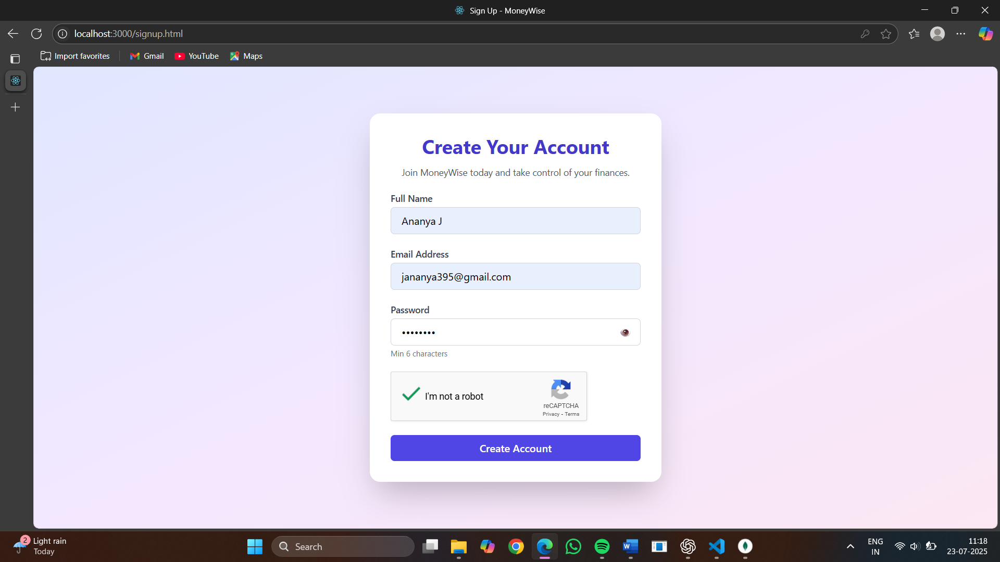
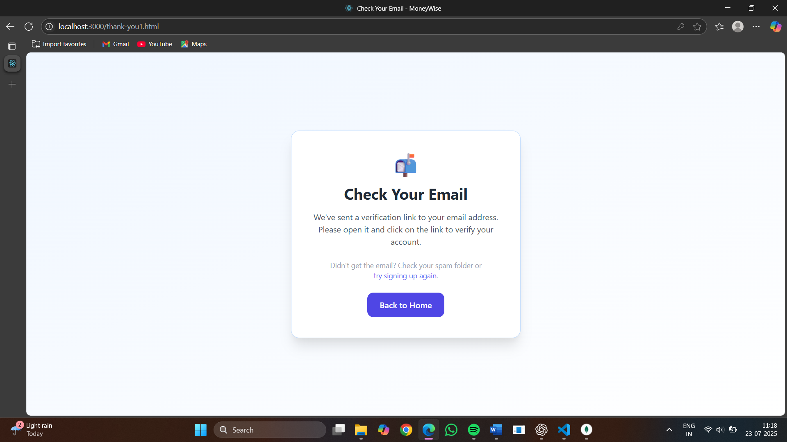
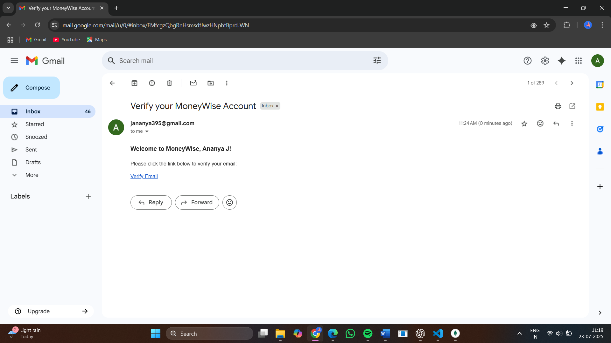
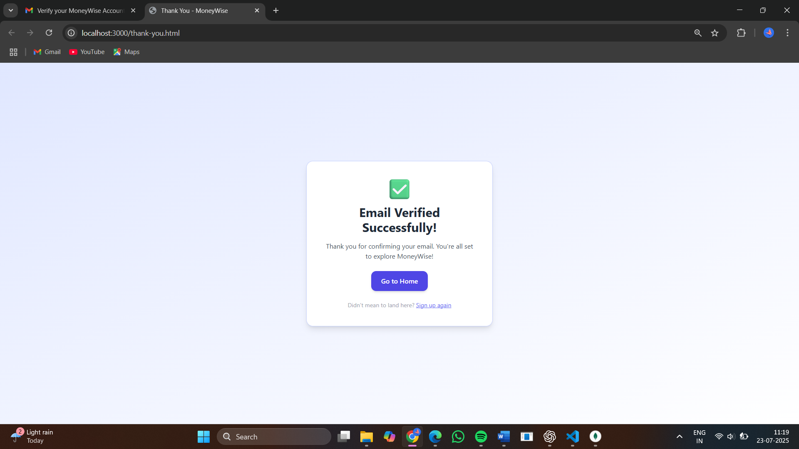
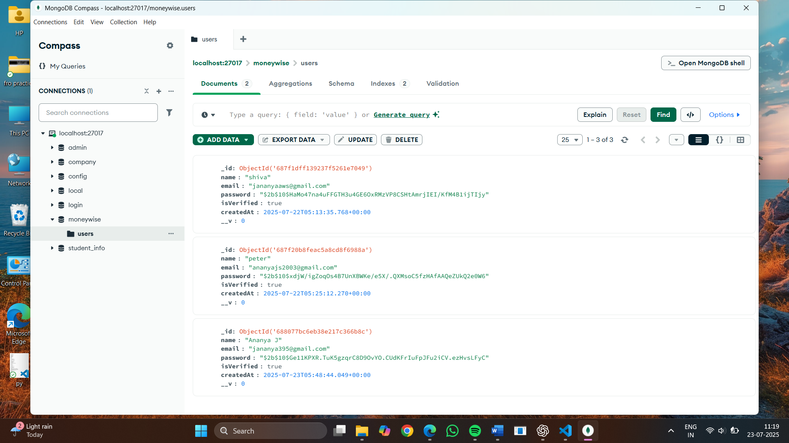

<<<<<<< HEAD
#  MoneyWise – SaaS Landing Page with Email Verification Workflow

MoneyWise is a modern, responsive SaaS landing page that includes a secure user sign-up system with email verification. It mimics the onboarding flow of real-world SaaS platforms by integrating frontend UI, form validation, reCAPTCHA, email verification via Nodemailer, and MongoDB for lead storage.

---

##  Features

- Fully responsive landing pages (Home, For Couples, For Professionals, Pricing)
- Sign-up form with client-side validation
- Google reCAPTCHA v2 integration
- Token-based email verification system using Nodemailer
- Secure password encryption with bcrypt
- MongoDB database integration (with verified status tracking)
- Thank-you pages after sign-up and after successful verification

---

## Tech Stack

| Category          | Tools/Technologies                             |
|-------------------|------------------------------------------------|
| **Frontend**      | HTML5, Tailwind CSS, Alpine.js                 |
| **Backend**       | Node.js, Express.js                            |
| **Database**      | MongoDB, Mongoose                              |
| **Security**      | bcryptjs, crypto                               |
| **Email Service** | Nodemailer + Gmail SMTP                        |
| **Anti-bot**      | Google reCAPTCHA                               |
| **Env Config**    | dotenv                                         |

---

###  Screenshots

####  Signup Page

####  Signup Page

####  Signup Page

####  Signup Page

####  Email Verified

##### Live demo
This link shows the landing pages and signup UI (no backend functionality):
[https://your-username.github.io/moneywise-final/](https://your-username.github.io/moneywise-final/)
=======
# final
>>>>>>> 941955bea7928e78de0c6e27278c9e5597bdd806
